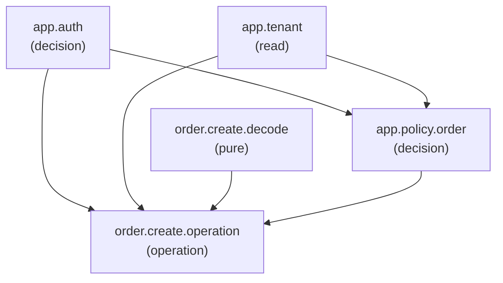

# Beyond the Pipeline: How the Runtime Execution Fabric (REF) Evolves `fh` into an Application Runtime

Modern Go HTTP frameworks—such as Gin, Echo, Fiber, FastHTTP, and conventional `fh`—are built upon a software architecture that has remained fundamentally unchanged for two decades: **the linear middleware pipeline**.

```text
Request ──▶ Middleware 1 ──▶ Middleware 2 ──▶ Middleware 3 ──▶ Handler ──▶ Response
```

While simple and intuitive for basic REST endpoints, the linear pipeline breaks down when building complex, distributed, multi-tenant enterprise applications. 

The **Runtime Execution Fabric (REF)** introduced in `fh` solves this by abandoning the pipeline paradigm entirely. It elevates `fh` from an HTTP router into a **compiled Capability + Policy + Effect Execution Runtime**, where HTTP is merely one transport projection among many.

---

## 1. The 6 Fatal Flaws of Linear Pipelines and How REF Fixes Each

### Flaw 1: Pipeline Tyranny and Artificial Serial Latency

#### The Problem in Traditional Frameworks:
Middleware must execute in a strict sequential order. Even though **Authentication**, **Tenant Resolution**, and **JSON Body Decoding** are completely independent of one another, the linear pipeline forces them to run serially:
```text
Rate Limit ──(3ms)──▶ Auth Check ──(4ms)──▶ Tenant Resolve ──(3ms)──▶ Body Decode ──(2ms)──▶ Handler
                                                                                Total Latency: 12ms
```
If each operation queries an external datastore (e.g., Redis rate-limit, JWT verification, PostgreSQL tenant lookup), their latencies accumulate additively.

#### How REF Fixes It: Dependency-Readiness DAG Scheduling
In REF, execution order is determined strictly by **data dependency**, not the arbitrary line order in which middleware were mounted.

1. Capabilities declare what facts they need (`Requires: []fact.AnyKey`) and produce (`Provides: []fact.AnyKey`).
2. During startup, Kahn's algorithm compiles an immutable DAG and computes dependency counters (`InitialDeps`).
3. At runtime, all nodes with `0` initial dependencies execute **concurrently**:
   ```text
   Traditional Pipeline:  [ Auth (4ms) ] ──▶ [ Tenant (3ms) ] ──▶ [ Decode (2ms) ] ──▶ Total: 9ms

   REF Readiness DAG:    ┌─▶ [ Auth (4ms) ] ──────────┐
                         ├─▶ [ Tenant (3ms) ] ────────┼──▶ Operation ──▶ Total: 4ms
                         └─▶ [ Decode (2ms) ] ────────┘
   ```
4. As each capability finishes, it atomically decrements downstream counters (`remaining.Add(-1)`). When a counter hits `0`, it launches immediately.
5. **Concrete Benefit:** Latency drops from the sum of all middleware to the **critical path length** ($\max(T_1, T_2, T_3)$).

---

### Flaw 2: The Shared Mutable Context Anti-Pattern ("String-Soup")

#### The Problem in Traditional Frameworks:
Middleware communicate by stuffing untyped, unstructured values into a shared request map:
```go
// Traditional HTTP Framework:
func TenantMiddleware(c fh.Ctx) error {
    c.Locals("tenant_id", c.Get("X-Tenant-ID")) // untyped string key
    return c.Next()
}

func Handler(c fh.Ctx) error {
    // 1. Silent runtime failure if key is mistyped ("tenantId" vs "tenant_id")
    // 2. Unsafe runtime type assertion prone to panics
    // 3. No compile-time guarantee that the middleware was even registered
    t, ok := c.Locals("tenant_id").(string) 
    if !ok {
        return c.Status(500).SendString("internal configuration error")
    }
    ...
}
```

#### How REF Fixes It: Typed Fact Keys & Dense Atomic Plan Slots
REF replaces string-keyed maps with **strongly typed Fact Keys** and compile-time slot allocation:

```go
// 1. Declare typed fact key at package level
var TenantKey    = fact.NewKey[string]("app.tenant_id")
var PrincipalKey = fact.NewKey[PrincipalFact]("auth.principal")

// 2. Capability publishes typed value safely (compiler prevents wrong types)
func TenantCapability(nc *ref.NodeContext) error {
    ref.Publish(nc, TenantKey, "acme-corp") // Type-checked at compile time!
    return nil
}

// 3. Intent receives typed value directly without type assertions
func (MyIntent) Run(nc *ref.NodeContext, in MyInput) (ref.Outcome[MyOutput], error) {
    tenantID, err := ref.Require(nc, TenantKey) // Returns string, not any!
    if err != nil {
        return ref.Outcome[MyOutput]{}, err
    }
    ...
}
```

#### Under the Hood:
- At compile time, every unique `DefinitionID` is assigned a contiguous index `PlanSlot(0..N-1)`.
- At runtime, [`fact.Store`](file:///Users/sujit/Sites/fh/ref/fact/store.go) stores values in a contiguous slice (`slots []any`) synchronized by atomic flags (`flags []atomic.Uint32`).
- Reading a fact is an array lookup: $O(1)$, zero string hashing, zero map locks, zero heap allocations.
- Missing dependencies are caught during startup compilation (`g, err := graph.Build(...)`), not via runtime panics in production.

---

### Flaw 3: Protocol Entanglement (Transport Lock-In)

#### The Problem in Traditional Frameworks:
Business logic is inextricably tied to HTTP structs (`fh.Ctx`, `http.Request`, `http.ResponseWriter`):
```go
// Traditional Handler:
func HandleCreateOrder(c fh.Ctx) error {
    token := c.Get("Authorization")
    var req OrderInput
    if err := c.BodyParser(&req); err != nil { 
        return c.Status(400).SendString("Invalid JSON") 
    }
    // Business logic mixed with HTTP response codes
    res := processOrder(token, req)
    c.Set("X-Custom-Header", "processed")
    return c.Status(201).JSON(res)
}
```
If the business needs this same order creation triggered via **gRPC**, **WebSocket frames**, **Kafka/RabbitMQ events**, or a **CLI command**, the handler cannot be reused. Developers either duplicate domain logic or build synthetic HTTP requests.

#### How REF Fixes It: Pure Intent Contracts & Transport Projections
In REF, business logic is written as a transport-neutral [`Intent[I, O]`](file:///Users/sujit/Sites/fh/ref/intent/intent.go):

```go
type CreateOrderIntent struct{}

func (CreateOrderIntent) Name() ref.IntentName { return "order.create" }

func (CreateOrderIntent) Spec() ref.Spec {
    return ref.Spec{
        Requires: []fact.AnyKey{capability.PrincipalKey.Any(), TenantKey.Any()},
    }
}

// Pure domain logic: zero HTTP concepts, zero headers, zero status codes!
func (CreateOrderIntent) Run(nc *ref.NodeContext, in OrderInput) (ref.Outcome[OrderOutput], error) {
    user, _ := ref.Require(nc, capability.PrincipalKey)
    tenant, _ := ref.Require(nc, TenantKey)

    return ref.Outcome[OrderOutput]{
        Value: OrderOutput{OrderID: "ord-100", Total: in.Price * float64(in.Quantity)},
    }, nil
}
```

#### Transport Projections:
The exact same compiled intent can be mounted anywhere through transport adapters:
```go
// 1. HTTP Endpoint (fh)
app.Post("/orders", refHttp.Adapter(engine, "order.create"))

// 2. gRPC Unary Service
grpcServer.RegisterService(&OrderServiceDesc, refGrpc.UnaryHandler(engine, "order.create"))

// 3. WebSocket Message Dispatcher
wsHandler := refWs.Handler(engine)

// 4. Kafka / RabbitMQ Consumer
queueConsumer := refQueue.Consumer(engine, "order.create")

// 5. CLI Command-Line Direct Dispatch
cliCmd := refCli.Command(engine, "order.create")
```

When errors occur, REF maps transport-neutral categories into native protocol statuses:
- `CategoryInvalidInput` ➔ HTTP `422` / gRPC `INVALID_ARGUMENT` / CLI `exit 2`
- `CategoryNotFound` ➔ HTTP `404` / gRPC `NOT_FOUND` / CLI `exit 3`
- `CategoryPermission` ➔ HTTP `403` / gRPC `PERMISSION_DENIED` / CLI `exit 4`
- `CategoryRateLimit` ➔ HTTP `429` / gRPC `RESOURCE_EXHAUSTED` / CLI `exit 6`

---

### Flaw 4: The Uncontrolled Mutation Trap (Corrupted State on Crash)

#### The Problem in Traditional Frameworks:
Handlers execute ad-hoc direct database writes, payment gateway calls, and email dispatches in the middle of request execution:
```go
// Traditional Handler:
func HandleTransfer(c fh.Ctx) error {
    // Direct DB mutation
    db.Exec("UPDATE accounts SET balance = balance - 100 WHERE id = ?", from)
    
    // SERVER CRASHES OR NETWORK TIMEOUTS HERE!
    err := paymentGateway.Charge(...) // If this fails, balance was already debited!
    
    go mailer.SendReceipt(...) // Unbounded goroutine: lost if process terminates!
    return c.SendString("OK")
}
```
If a crash or network partition occurs halfway through, state is partially corrupted with no atomic guarantee, no rollback, and no record that notifications were scheduled.

#### How REF Fixes It: Two-Phase Controlled Mutation Runtime & Crash-Safe Outbox
In REF, **business operations never execute side effects directly**. Instead, `Intent.Run` returns an [`EffectPlan`](file:///Users/sujit/Sites/fh/ref/effect/effect.go#L51) describing mutations across three delivery tiers:
1. `LocalTransactional`: Local atomic database writes.
2. `DurableDelivery`: External webhooks, emails, and third-party APIs.
3. `FireAndForget`: Best-effort telemetry and cache warming.

```go
func (TransferIntent) Run(nc *ref.NodeContext, in TransferInput) (ref.Outcome[TransferOutput], error) {
    return ref.Outcome[TransferOutput]{
        Value: TransferOutput{Status: "accepted"},
        Effects: ref.EffectPlan{
            LocalTx: []ref.Effect{
                &DebitAccountEffect{Account: in.From, Amount: in.Amount},
                &CreditAccountEffect{Account: in.To, Amount: in.Amount},
            },
            Durable: []ref.Effect{
                &SendEmailNotificationEffect{UserID: in.UserID, Template: "transfer_receipt"},
            },
            FireAndForget: []ref.Effect{
                &EmitMetricEffect{Metric: "transfers.completed", Value: 1},
            },
        },
    }, nil
}
```

#### Crash-Safe Outbox Algorithm:
In [`effect.CommitPlan`](file:///Users/sujit/Sites/fh/ref/effect/effect.go#L90), durable outbox records are inserted into the **same database transaction** *before* the transaction commits:

```text
1. BEGIN DB TRANSACTION
2.   Insert Durable Outbox Records (Email, Webhook) into DB Outbox Table
3.   Execute Local Transactional Writes (Debit, Credit) in DB
4. COMMIT DB TRANSACTION ──▶ (Atomically commits domain writes AND outbox records together!)
5. Schedule delivery worker for immediate dispatch
6. Execute Fire-and-Forget telemetry
```

- **Atomicity:** Domain writes and outbox records commit together in the single DB transaction.
- **Crash Recovery:** If the process loses power after step 4, the background outbox worker resumes delivery upon restart. No notification is ever lost.
- **Compensating Rollback:** If any local transactional write fails before commit, registered [`CompensatingEffect`](file:///Users/sujit/Sites/fh/ref/effect/effect.go#L45) functions execute in reverse order to restore previous state.

---

### Flaw 5: The Speculation Dilemma (Blocking on Policy)

#### The Problem in Traditional Frameworks:
Authorization checks (e.g., querying Open Policy Agent, evaluating RBAC/ABAC rules) often take 5–20ms. In a linear pipeline, body decoding and read-only cache queries are completely stalled waiting for authorization to complete.

#### How REF Fixes It: Compiler-Enforced Speculation Classes & Gated-Wait Queues
REF allows safe nodes to run **speculatively** before authorization is finalized, while mathematically guaranteeing that unverified nodes can never execute.

Nodes declare an explicit [`SpeculationClass`](file:///Users/sujit/Sites/fh/ref/graph/node.go#L43-L50):
- `PreAuthSafe`: Safe before authentication (e.g., pure JSON payload decoding, cryptographic token signature verification).
- `PostIdentitySafe`: Safe after principal identity is established, but before authorization decisions pass (e.g., pre-fetching user preferences from cache).
- `PostPolicySafe`: Strictly requires all policy decisions to have passed.
- `NoSpeculation` *(Default)*: Must wait for complete authorization.

#### Compiler-Enforced Verification at Startup:
During `engine.Compile()`, [`enforceSpeculationInvariants`](file:///Users/sujit/Sites/fh/ref/runtime/engine.go#L249) mathematically traverses the DAG:
- Any node marked `PostIdentitySafe` must have a verified transitive path from an identity-producing node (like `app.auth`).
- Any node marked `PostPolicySafe` must have a verified transitive path from all policy decision nodes.
- **Unverified developer hints are rejected at startup compilation, preventing security regressions.**

#### Gated-Wait Scheduling (No Deadlocks):
```text
dependency-ready
       ↓
gate eligible?
   /       \
 yes       no
  ↓         ↓
runnable   gated-wait (bitmask)
              ↓
         gate changes
              ↓
          runnable
```
If dependencies are ready but decisions are pending, nodes wait in `gatedWait` (managed via zero-allocation `uint64` bitmasks). When policies resolve, waiting nodes are promoted to runnable without deadlock.

---

### Flaw 6: Fragile Security & Black-Box Evaluation

#### The Problem in Traditional Frameworks:
Middleware evaluate security serially. The first middleware calls `c.Next()`. Another middleware might overwrite tenant or user context fields, leading to the **confused deputy problem**:
```go
// Traditional: Last writer wins, confused deputy hazard
c.Locals("tenant", "org-A") // Set by header
...
c.Locals("tenant", "org-B") // Overwritten by nested middleware!
```
Observability systems only see wall-clock time between `c.Next()`. They cannot inspect what access boundaries were enforced.

#### How REF Fixes It: Algebraic Policy Composition & Real-Time Introspection
In REF, security policies are first-class [`DecisionNode`](file:///Users/sujit/Sites/fh/ref/graph/node.go#L13)s evaluated through [`DecisionSet`](file:///Users/sujit/Sites/fh/ref/execution/decision.go):
1. **DENY Dominates:** Any single `RecordDeny` halts execution immediately.
2. **All Declared Policies Must Complete:** In REF, `VerdictAllow` is returned **only when `completed >= required && !denied`**. Partial allows never unblock the Effect Barrier.
3. **Constraint Intersection:** Access constraints (allowed regions, tenant IDs, field projections) are algebraically intersected across all policies.
4. **Contradiction Detection:** If Policy 1 specifies `tenant = "org-A"` and Policy 2 specifies `tenant = "org-B"`, REF detects the contradiction and **automatically converts the verdict to `VerdictDeny`**. Last-writer does not win; security is preserved.
5. **Real-time Introspection:** Every intent plan can be inspected as live JSON or interactive Mermaid diagrams:



---

## 2. Summary Comparison Matrix: Traditional Pipeline vs. REF

| Dimension | Traditional HTTP Server (`fh`, Gin, Fiber, Echo) | Runtime Execution Fabric (REF) |
|---|---|---|
| **Execution Order** | Sequential pipeline: $M_1 \to M_2 \to M_3 \to H$ | **Dependency-readiness DAG:** nodes execute as soon as prerequisites exist |
| **Concurrency** | Single-threaded per request (or manual `go func()`) | **Automatic parallel waves:** independent capabilities run concurrently |
| **Inter-node Data** | Untyped string keys in shared context: `c.Locals("k")` | **Typed Facts:** compile-time `Key[T]` mapped to dense atomic `PlanSlot`s |
| **Transport Binding** | Direct `fh.Ctx` or `http.ResponseWriter` | **Transport Neutral:** Domain logic receives typed `I` and produces `Outcome[O]` |
| **Side Effects** | Direct ad-hoc I/O inside the handler | **Authorized Effect Runtime:** declarative `EffectPlan` with 2-phase atomic commit |
| **Security Gate** | Early middleware runs; handler writes directly | **Effect Barrier:** No side effects can execute without complete policy clearance |
| **Speculation** | Not possible; everything blocks | **Compiler-Enforced Speculation:** `PreAuthSafe`, `PostIdentitySafe`, `NoSpeculation` |
| **Policy Model** | First middleware to return error halts pipeline | **Algebraic Composition:** Parallel evaluation, DENY-dominates, constraint intersection |
| **Fault Recovery** | Partial writes leak on crash | **Crash-safe Outbox:** Domain writes + durable records commit in the *same* DB transaction |
| **Observability** | Wall-clock middleware timers | **Graph Introspection:** Live JSON inspection, Mermaid DAGs, 3-tier telemetry |

---

## 3. High-Performance Runtime Engineering

To ensure REF incurs minimal runtime overhead, the execution kernel incorporates key systems optimizations:

1. **Dense Fact Slots (`PlanSlot`):** Fact reads and writes are direct slice index lookups with atomic flags. Zero map lookups, zero hashing, zero string allocations.
2. **Synchronous Fast-Path:** For sequential steps (when only 1 node is ready and no sibling nodes are in flight), the scheduler executes the node **inline on the caller's stack**, completely bypassing goroutine creation, closure allocations, and channel overhead. Concurrency is launched only when parallel branches fork.
3. **Multi-tier Object Pooling (`sync.Pool`):**
   - [`NodeContext`](file:///Users/sujit/Sites/fh/ref/execution/context.go) instances are pooled.
   - [`fact.Store`](file:///Users/sujit/Sites/fh/ref/fact/store.go) instances are pooled.
   - [`DecisionSet`](file:///Users/sujit/Sites/fh/ref/execution/decision.go) instances are pooled.
   - Channel and dependency tracking slices are pooled.
4. **Zero-Allocation Gated Queue:** For plans with up to 64 nodes, the waiting queue is managed using bitwise operations on a single `uint64` bitmask (`gatedMask`), requiring zero heap allocations for maps.
5. **No `context.WithValue` Wrapping:** `NodeContext` directly implements `context.Context` and intercepts custom keys, eliminating context wrapper allocations on every node.

### Benchmark Profile (Apple M2 Pro)

```bash
$ go test -bench=BenchmarkREFDispatch -benchmem ./ref
BenchmarkREFDispatch-10    	  134340	      7743 ns/op	    1000 B/op	      24 allocs/op
PASS
```
- **Throughput:** >134,000 to 164,000 dispatches per second on a single thread.
- **Memory:** Only **1,000 bytes allocated per dispatch** for full end-to-end DAG traversal, authentication, tenant resolution, policy evaluation, and result projection.

---

## 4. Migration: Elevating `fh` Without Rewriting

Adopting REF does **not** break existing `fh` code. It is 100% additive:

```go
app := fh.NewFast()

// 1. Enable REF on the existing application
engine := app.EnableREF()

// 2. Register capabilities and intents
ref.RegisterCapability(engine, NewAppAuthCapability())
ref.Register(engine, CreateOrderIntent{})
engine.Compile()

// 3. Mount side-by-side with standard lightweight routes
app.Get("/health", func(c fh.Ctx) error {
    return c.SendString("OK")
})
app.Post("/orders", refHttp.Adapter(engine, "order.create"))
```

---

## Conclusion

The Runtime Execution Fabric transforms `fh` from a fast HTTP router into an **application execution platform**. 

By replacing sequential pipeline execution with dependency readiness, eliminating mutable context string-soup with typed facts, enforcing security policies algebraically before side effects, and guaranteeing crash safety through transactional outbox effects, REF provides the architectural foundation for mission-critical, high-performance Go microservices.
